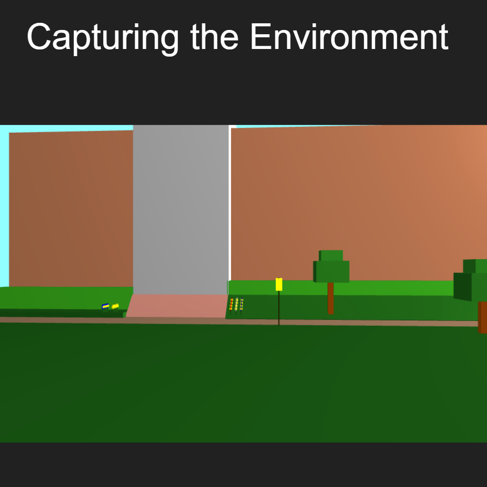
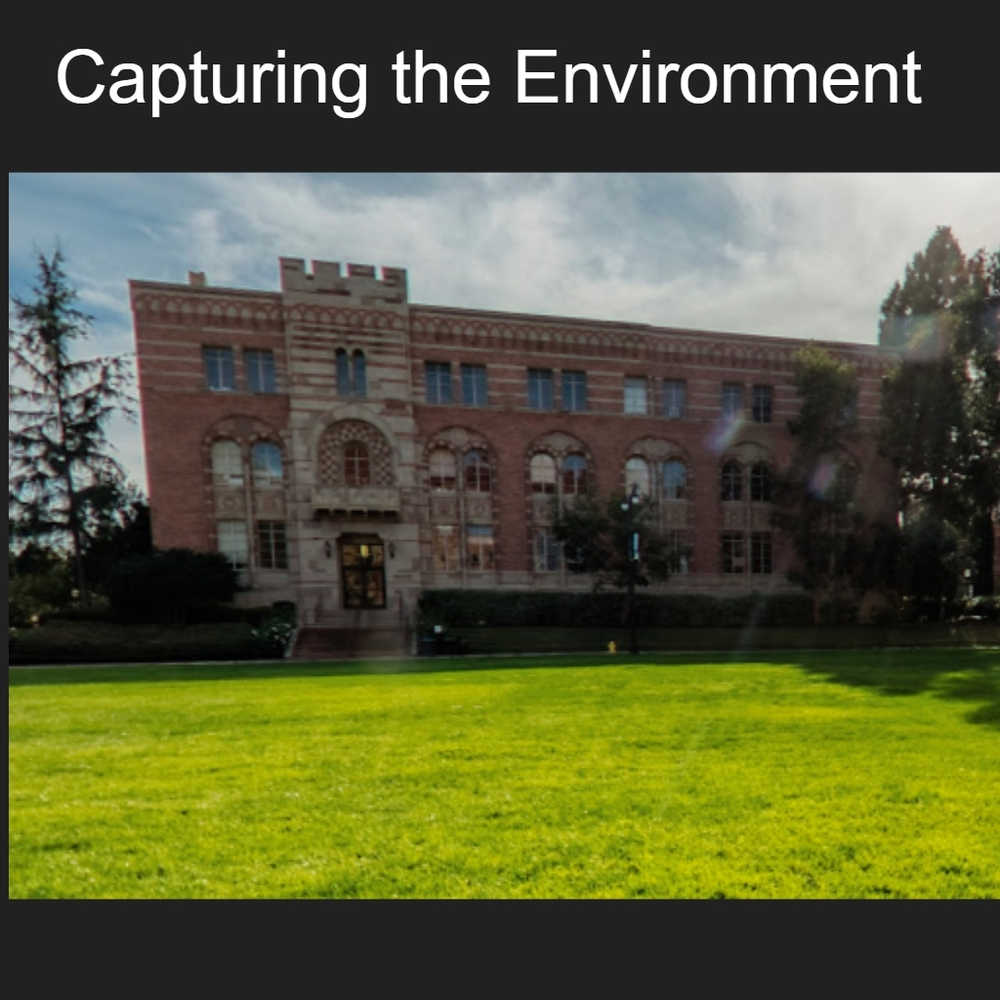
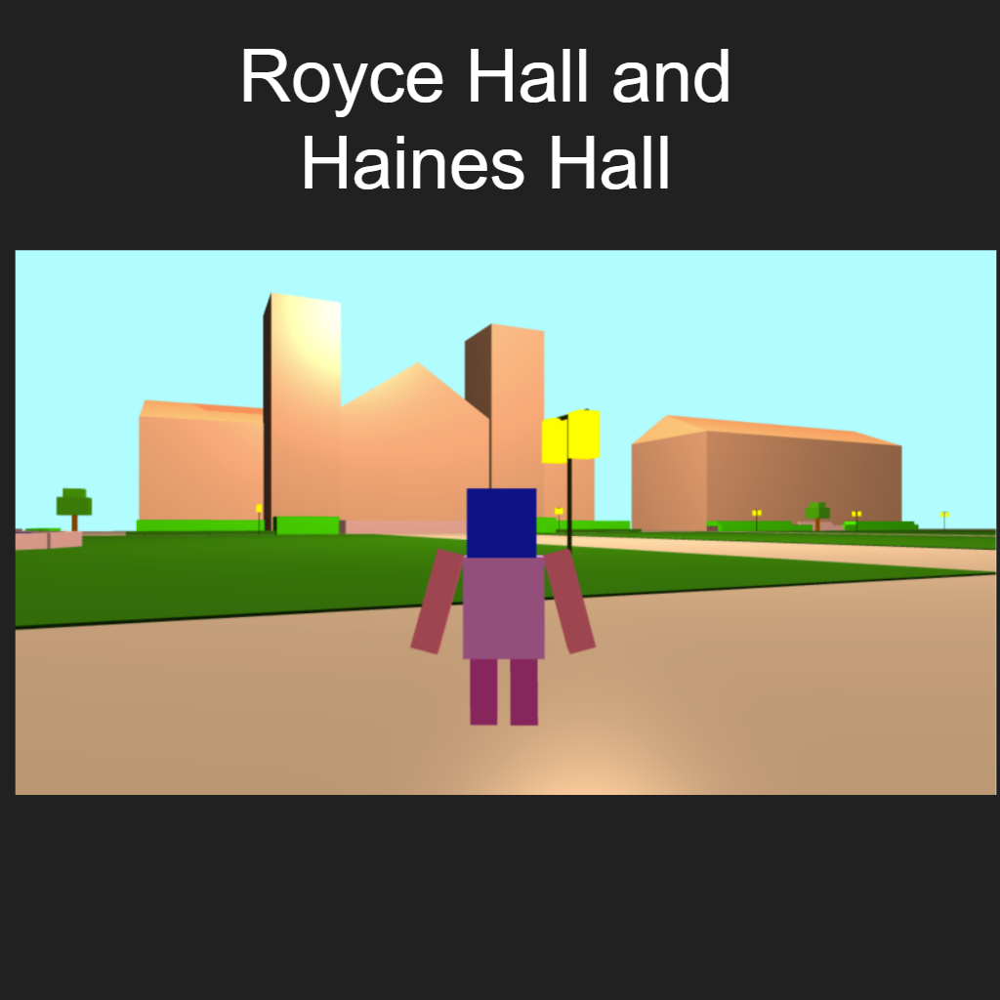
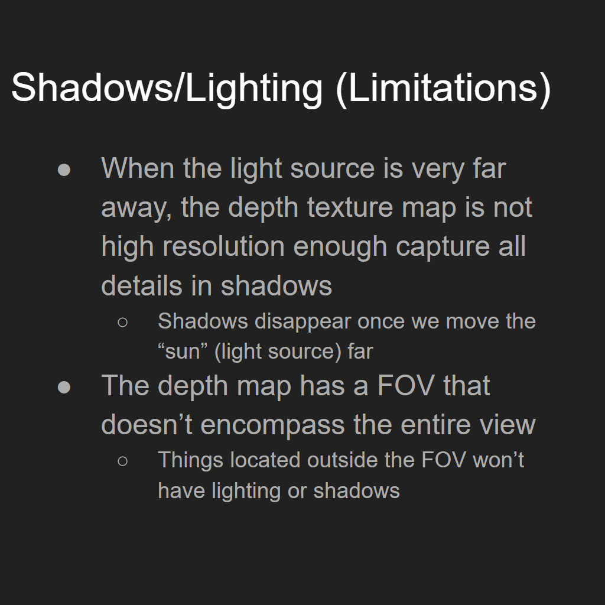
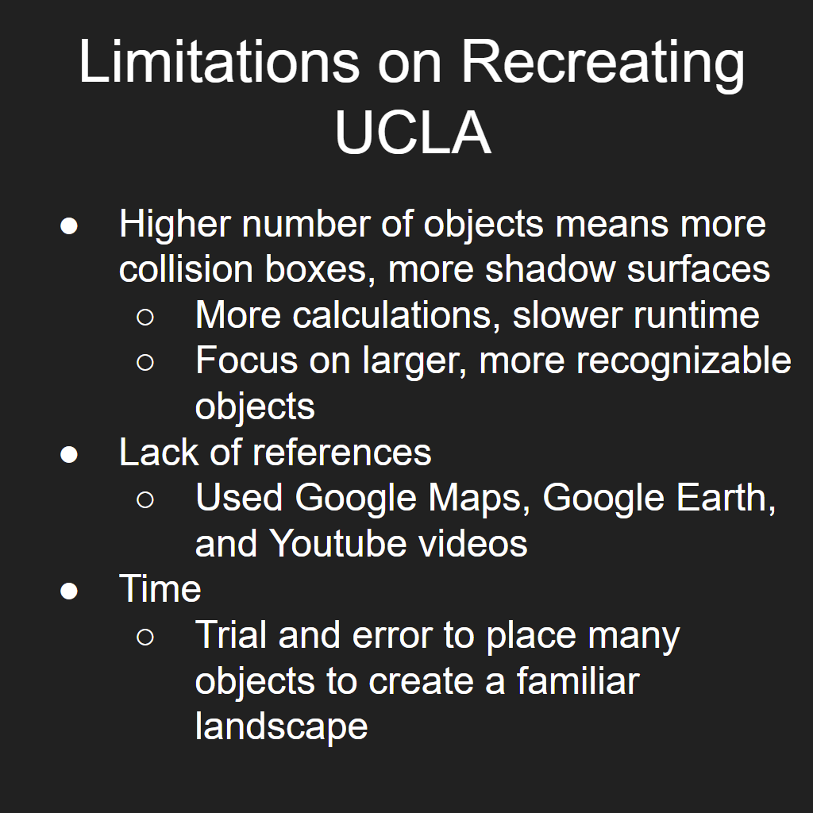
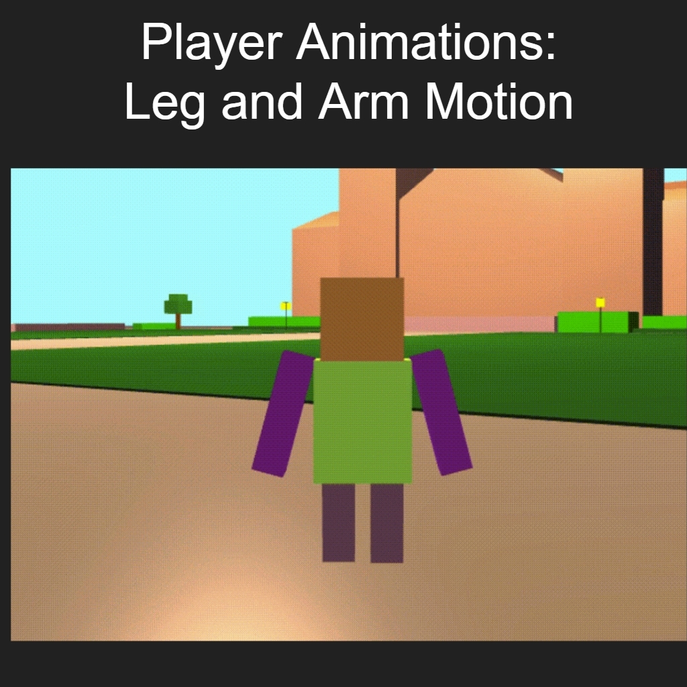
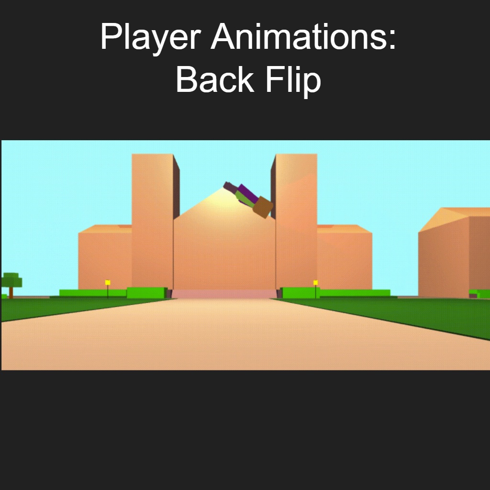
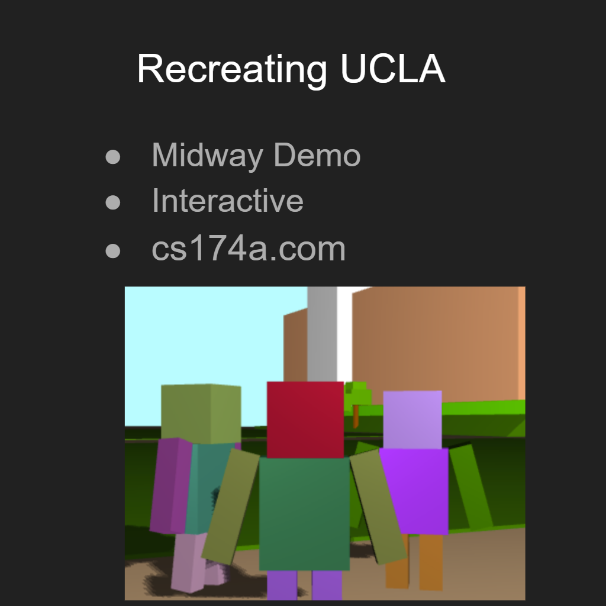

# Report

Group Members: Abel Calvet, John Houser, Yuhan Liu, Jorge Contreras

Our goal with this project was to recreate the area of campus between Royce Hall and Powell Library. We know that many of us aren't on campus, so we thought it would be cool if we created a virtual version that would allow users to see each other on this virtual campus. In order to accomplish this, we implemented a node.js express server and created a website that would allow visitors to see eachother move in the world. This feature is not graphics related, so we also pursued five advanced features...

Here is a breakdown of each of our features:

References:
We used code from examples (Collision Detection, Textures) included in the tiny graphics library. We also used the TA's shadow code.

# How to run the code (node.js express server)
Our project implements a node.js express server that allows players to interact with eachother:

In order to run the code you must follow the following steps...

1) git clone/pull this repo 
2) enter the team-project-recreationists folder
3) type 'npm install' in CLI (get npm if you don't already have it)
4) type 'node index.js'
5) visit localhost:5000

And you can see the world we've created!
